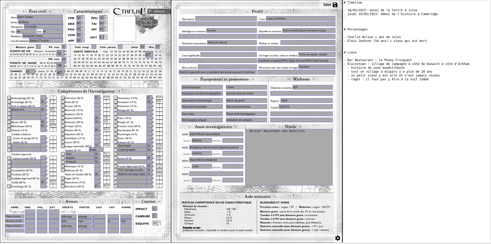

# VirtualRpgCharacterSheet

Simple RPG character sheet manager for players and GMs.

This tool aims to work without any back ou server, just the web client host somewhere.

Disclaimer: THIS IS A WORKING IN PROGRESS PROJECT SO IT'S NOT A PERFECT TOOL! You are welcome for tests and give feedback!

[See deployed version on Github Pages](https://kuroidoruido.github.io/virtual-rpg-character-sheet/)

# State of the project

## What's working?

- can play to some games
- can save (local storage = in your browser) your sheet state
- have different placeholders: 
    - text (static, readonly)
    - checkbox/checkbox bar (for example for Call of Cthulhu v7 we can use this for life point)
    - textarea (for multiline text input)
    - computed input (for value that depends from other ones)
- a simple dice roller
- Save with Ctrl+Shift+s
- free note zone (for taking notes during a session)
- share link: will offer a way to make someone else our sheet (without server)
- radio element (grouped) with differents visual shape (cross, circle, square)

## Supported games

- Billet Rouge
    - FR sheet
- Cats! La Mascarade
    - FR Bastet sheet
    - FR Cat sheet
    - FR Cat 2 sheet
    - FR Human sheet
- Cthulhu v7:
    - FR classical sheet
- Nains & Jardins
    - FR sheet

## What's next?

- Save needed indicator (when data are changed and we have not saved yet)
- import/export feature
- print mode (convert editable field as static field, make multiple page on column, make it fit in A4 pages)
- can keep more than one character for one particular game for one user
- a sheet builder assistant (because it's really boring to make it through json...)
- insert image (character photo), should be save as Base64 to have no external files + resize/compress to be lightweight
- home page with product presentation
- replace local storage by IndexedDB

# LICENSE

All this project is under GNU General Public Licence 3.0 (see [LICENSE](https://github.com/kuroidoruido/virtual-rpg-character-sheet/blob/master/LICENSE) file) except character sheets that are under them authors copyright.

If you are one of the author of these character sheets, you can contact me for any question.